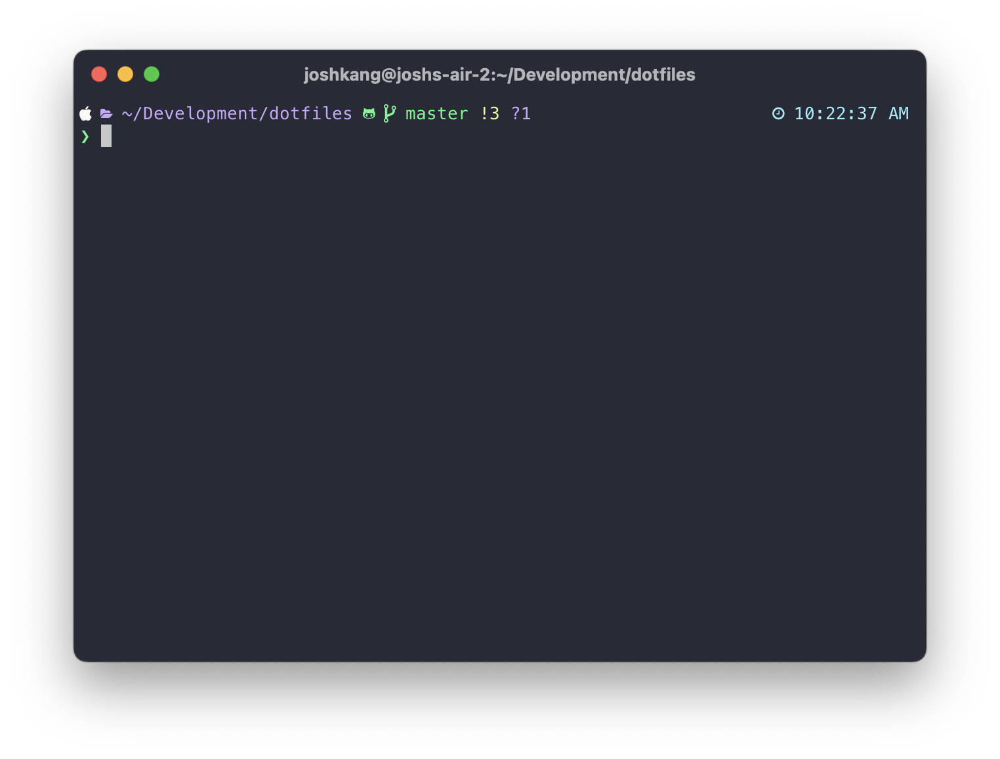

# Dotfiles and setup script



## Installation

Install `brew` and clone this git repository by using the below command.

This script is designed for provisioning brand new mac systems, so it is not required to clone the repository first.

```shell
curl https://raw.githubusercontent.com/kngroo/dotfiles/HEAD/scripts/install.sh | bash
```

[Generate a new SSH key and add it to ssh-agent for github](https://docs.github.com/en/authentication/connecting-to-github-with-ssh/generating-a-new-ssh-key-and-adding-it-to-the-ssh-agent)

## Brewfile

- [antibody](https://getantibody.github.io/)
- [gh](https://cli.github.com/)
- [stow](https://www.gnu.org/software/stow/)

## Makefile

Install zsh plugins
`make ohmyzsh`
